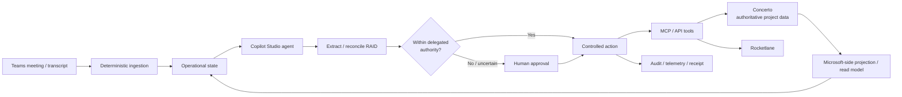
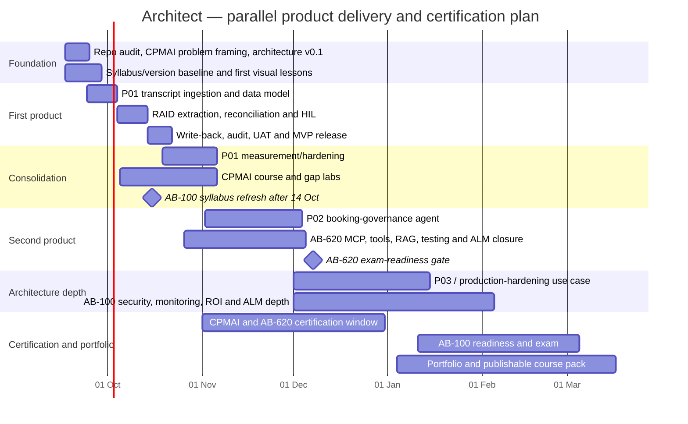

# Architect: Onboarding and Delivery Plan for an AI Builder-to-Architect Learning Programme

## Executive summary

**Architect should not be a certification-study repository with a project bolted onto it. It should be a product-delivery repository with a structured learning system running through it.**

The objective is to help Warwick move from an experienced implementation/project professional who can make AI-assisted solutions work into someone who can **identify the right AI opportunity, architect the end-to-end solution, understand the Microsoft implementation stack, build enough of it to be credible, and explain the commercial and technical trade-offs**. The career target is the sort of AI transformation/solution architecture role discussed in relation to DEPT, roughly in the £70–80k range; the exact DEPT competency requirements remain an assumption until a current role specification or feedback rubric is added to the repo.

Four learning frameworks should be woven into one programme rather than studied sequentially:

| Layer | Primary question | Role in Architect |
|---|---|---|
| **PMI-CPMAI** | Should we do this, why, with what data, and how will value be measured? | Business/value/delivery methodology |
| **AB-100** | What should the overall solution be, and why? | Architecture spine |
| **AB-410** | How do the data, apps, process and deterministic automation work? | Microsoft business-solution plumbing |
| **AB-620** | How do agents reason, retrieve knowledge and safely use tools? | Agent/integration layer |

That division follows the official objectives closely. CPMAI covers matching AI to business needs, data, iterative development, evaluation and operationalisation. AB-410 covers Power Platform solution design, Dataverse, apps, flows, approvals and business logic. AB-620 covers agent design, enterprise integrations, MCP, APIs, RAG, human-in-the-loop flows, evaluation and ALM. AB-100 explicitly moves above those concerns into architecture strategy, agent suitability, build/buy/extend decisions, ROI, grounding, MCP, security, monitoring, ALM and enterprise deployment. citeturn19view0turn24view0turn19view1turn24view2

The recommended certification route is therefore:

> **Learn CPMAI + AB-410 + AB-620 + AB-100 together → sit CPMAI → sit AB-620 → sit AB-100.**

AB-410 should be fully mapped and studied because Warwick needs the knowledge, but **the AB-410 exam is optional by default**. AB-620 is the more relevant Associate certification for the intended agentic-AI direction, and either AB-620 or AB-410 currently satisfies the Associate prerequisite for Microsoft's Agentic AI Business Solutions Architect Expert certification. citeturn19view3

A significant timing detail is that, as of **17 September 2026**, Microsoft has already published an AB-100 study guide labelled **“Skills measured as of October 14, 2026”**, while the certification page says the English certification will update on that date. Architect should therefore version the AB-100 objectives now and automatically re-check them after **14 October 2026**, rather than hard-coding a syllabus that may be stale within weeks. citeturn24view2turn19view3

**Product delivery must not wait for certification.** The first useful product should ship in approximately **3–5 weeks**, with further products or vertical slices shipped during a **4–6 month** certification journey. The first proposed MVP is deliberately narrow:

> **Teams transcript → structured RAID candidates → reconcile against existing state → human review where required → controlled write-back → audit receipt.**

That project already exercises a remarkably large proportion of AB-410 and AB-620, while giving AB-100 and CPMAI real architecture and business-value decisions to interrogate. Microsoft explicitly recommends hands-on experience for both AB-410 and AB-620; AB-620 in particular expects practical knowledge of MCP, REST integrations, RAG, Copilot Studio, agent flows, evaluation and ALM. citeturn24view0turn19view1

The operating principle should be:

> **Architect first enough to make a defensible decision. Learn just enough to implement it properly. Build quickly. Measure what happened. Revisit the architecture. Record the evidence. Ship.**

Not:

> Study everything → become theoretically ready → finally build something six months later.

The repository should consequently become **six things simultaneously**:

1. Warwick's practical curriculum.
2. The architecture record for real products.
3. Claude Code's operating handbook.
4. A portfolio/evidence system.
5. A certification coverage tracker.
6. The source material for a later visual YouTube/Udemy course.

## Objective and operating model

The primary business objective of Architect is:

> **Build useful, production-shaped AI solutions for Warwick's real PMO/implementation work while deliberately developing and evidencing the skills needed to operate as an AI solutions architect rather than merely an AI-assisted builder.**

The project therefore has three outcomes that must remain separate enough to measure.

**Business outcome:** ship automation/agent products that materially reduce low-value PM administration while preserving governance where judgement is genuinely required.

**Learning outcome:** close Warwick's uneven knowledge profile. He already has practical experience building solutions and using AI tools, but only PL-900 formal grounding in the Power Platform route; Architect therefore needs to revisit fundamentals without forcing him through a beginner-to-advanced course in Microsoft's prescribed order.

**Career outcome:** create credible evidence for roles such as the DEPT opportunity previously discussed: not simply “I have certifications”, but “here is a business problem I analysed, the architecture I designed, the trade-offs I recorded, the system I delivered, how I secured/evaluated it, and the measurable result”.

The first project should be treated as **Product P01: PMO Meeting Intelligence**, not as “the AB-620 lab”.

Its initial architecture hypothesis is:



This is an **architecture v0.1 hypothesis, not a predetermined implementation**. It exists so Warwick can challenge it as his knowledge increases.

Several architectural principles should be established immediately:

**Concerto remains authoritative** for project/customer/commercial information unless the organisation explicitly decides otherwise. Dataverse should hold only the data needed to support the Microsoft solution plus PMO-specific operational state, decisions and history. That prevents Architect from accidentally creating an independent editable project master.

**Deterministic operations stay deterministic.** Fetching a record, checking an explicit threshold, creating an approval, writing an accepted value and recording a receipt generally do not require an LLM. The agent is used where language interpretation, contextual synthesis, uncertain matching or bounded reasoning produces value.

**AI authority is explicit.** Every consequential tool should have defined permissions and thresholds. “The model thought this looked reasonable” is not an authorisation model.

**Identity should be retrieved, not guessed.** If Concerto or another authoritative project system knows which contact belongs to the project, the solution should use that record rather than infer identity from Outlook search results.

**Architecture is iterative.** Every important change should generate an Architecture Decision Record rather than silently replacing yesterday's reasoning.

These principles align particularly well with AB-100's emphasis on deciding when agents are appropriate, reviewing grounding data, defining solution rules and constraints, build/buy/extend decisions, ROI, security, monitoring and ALM. Microsoft's forthcoming October AB-100 blueprint also explicitly covers MCP extensibility, Copilot Studio, Teams/SharePoint, agent types, grounding, Well-Architected design, telemetry, testing and audit trails. citeturn24view2

A useful operating loop for the whole repo is therefore:

```text
BUSINESS PROBLEM
      │
      ▼
CPMAI
Why? Value? Data? Success? Risk?
      │
      ▼
AB-100
Architecture hypothesis + trade-offs
      │
      ▼
AB-410 / AB-620
Learn the implementation options needed now
      │
      ▼
BUILD + TEST
Real product / vertical slice
      │
      ▼
EVIDENCE + METRICS
Did it work? What did Warwick learn?
      │
      └──────────────► revise architecture / next sprint
```

## Required deliverables and repository structure

The repository should separate **curriculum**, **architecture**, **real products**, **evidence**, and **publishable learning material**. Mixing them will eventually produce either a messy software repo or an unusable pile of certification notes.

A recommended structure is:

```text
Architect/
│
├── README.md
├── CLAUDE.md
├── PROJECT.md
│
├── curriculum/
│   ├── MASTER-SYLLABUS.md
│   ├── COVERAGE-MATRIX.csv
│   ├── GAP-BACKLOG.md
│   └── objectives/
│       ├── cpmai.md
│       ├── ab-410.md
│       ├── ab-620.md
│       └── ab-100.md
│
├── architecture/
│   ├── 00-business-problem.md
│   ├── 01-context-and-boundaries.md
│   ├── 02-architecture-v0.1.md
│   ├── 03-data-authority.md
│   ├── 04-security-and-human-authority.md
│   ├── 05-non-functional-requirements.md
│   ├── 06-value-and-roi.md
│   └── ADR/
│       ├── ADR-0001-authoritative-project-data.md
│       └── ADR-0002-agentic-vs-deterministic.md
│
├── products/
│   ├── p01-meeting-intelligence/
│   │   ├── README.md
│   │   ├── backlog.md
│   │   ├── design/
│   │   ├── src/
│   │   ├── tests/
│   │   ├── runbooks/
│   │   └── evidence/
│   ├── p02-booking-governance/
│   └── p03-tbd/
│
├── lessons/
│   ├── L000-microsoft-stack-map/
│   ├── L010-data-authority/
│   ├── L020-dataverse/
│   └── ...
│
├── labs/
│   └── exam-gap-labs/
│
├── evidence/
│   ├── INDEX.md
│   ├── screenshots/
│   ├── test-results/
│   ├── architecture/
│   └── demonstrations/
│
├── publishable/
│   ├── README.md
│   ├── course-map.md
│   ├── youtube/
│   ├── udemy/
│   └── assets/
│
├── references/
│   ├── SOURCE-REGISTER.md
│   ├── VERSION-WATCH.md
│   └── curated-learning.md
│
├── templates/
│   ├── lesson-template.md
│   ├── build-task-template.md
│   ├── adr-template.md
│   ├── evidence-template.md
│   └── visual-lesson-template.md
│
└── progress/
    ├── DASHBOARD.md
    └── WEEKLY-REVIEW.md
```

The syllabus must be copied as **objective mappings, not copied course content**. AB-410's official weighting is currently 25–30% foundation, 25–30% intelligent applications and 40–45% business logic/automation. The objectives include Dataverse modelling, security, model-driven/canvas applications, flows, connectors, approvals, prompts and business/process logic. citeturn24view0 AB-620 is 30–35% planning/configuration, 40–45% integration/extension and 20–25% testing/management; its objectives include enterprise integration and identity, agent flows and HIL, knowledge, MCP, REST APIs, Azure AI Search, multi-agent solutions, A2A, Foundry, Application Insights, test sets and Power Platform ALM. citeturn19view1

The central `COVERAGE-MATRIX.csv` should therefore use columns such as:

```text
Framework,Objective_ID,Objective,Weight_or_priority,
Lesson,Product,Evidence,Status,Confidence,
Last_practised,Last_retested,Source_version,Notes
```

The recommended status progression is:

> **Unseen → Explained → Labbed → Applied → Evidenced → Exam-ready**

“Claude built it” must never be sufficient to advance an objective to *Evidenced*.

| Deliverable | Primary owner | Format | Acceptance criterion |
|---|---|---|---|
| Master syllabus | Assistant + Claude | Markdown | Every CPMAI/410/620/100 objective has a stable ID and source/version |
| Coverage matrix | Claude; Warwick validates | CSV/Markdown | Every objective maps to lesson, product evidence or explicit gap |
| Architecture pack | Warwick accountable; Assistant challenges; Claude documents | Markdown + Mermaid | Context, authority, boundaries, NFRs and major decisions are explicit |
| ADR register | Claude drafts; Warwick approves important decisions | Markdown | Any material architecture change records options, choice and rationale |
| Lesson assets | Claude | Markdown/slides/script/lab | Concept, visual, practical lab, quiz and objective mapping all present |
| Visual explainers | Claude | Slides + narration/storyboard | 5–10 minute visual explanation, one clear mental model, source register |
| Real product implementation | Claude + Warwick | Code/config/export/runbook | Feature works, tests exist, errors handled, architecture assumptions recorded |
| Warwick learning evidence | Warwick | Screenshots, notes, explain-backs, demos | Warwick can reproduce/explain the representative skill without black-box reliance |
| Test/evaluation evidence | Claude + Warwick | Test sets/results | Expected, failure and boundary cases recorded; agent output evaluated rather than merely demoed |
| Progress dashboard | Claude | Markdown | Business, curriculum and exam-readiness status visible on one page |
| Publishing pack | Claude; Warwick editorial owner | Slides/script/demo/assets | Contains no customer-confidential data and can stand independently of private project artefacts |
| Source/version register | Claude | Markdown | Primary URL, retrieval date, applicable objective and known update date captured |

A **visual lesson should be a first-class deliverable**, not an optional garnish, because Warwick has explicitly identified visual learning as important. A standard lesson package should contain:

```text
lesson.md
slides.md
video-script.md
storyboard.md
diagram.mmd
references.md
lab.md
quiz.md
evidence.md
```

The visual library should deliberately build reusable mental models: the Microsoft stack map; source-of-truth/data-authority map; deterministic-versus-agentic decision tree; transcript-to-RAID sequence diagram; identity/trust-boundary diagram; MCP tool-call lifecycle; HIL authority matrix; development/test/production ALM flow; RAG/grounding diagram; telemetry/evaluation loop.

This also creates course source material without allowing course production to become the primary project. `publishable/` should contain **sanitised derivatives** of lessons and demonstrations; confidential architecture/evidence stays elsewhere.

## Learning path and certification strategy

The four curricula should be **interleaved by product need**, not taught as four consecutive courses.

| Lens | What Warwick learns | P01 evidence |
|---|---|---|
| **CPMAI** | business need, feasibility, data, ROI, iterative AI delivery, evaluation, operationalisation | business case, baseline metrics, data assessment, acceptance criteria, benefits review |
| **AB-100** | architecture, agent suitability, source-of-truth, build/buy/extend, security, ROI, testing, telemetry, ALM | context diagram, ADRs, authority model, threat/trust map, NFRs, production architecture |
| **AB-410** | Dataverse, Power Platform solution design, flows, connectors, approvals, business logic, app/UI, environments | read model, operational tables, deterministic flows, approval path, solution packaging |
| **AB-620** | Copilot Studio, tools, MCP/APIs, knowledge/RAG, HIL, identity, advanced agent design, evaluation, ALM | extraction/reconciliation agent, governed tools, test sets, monitoring, deployment |

This mapping is not artificial. PMI's official CPMAI course moves from matching AI to business requirements and ROI through data identification/preparation, iterative development, testing/evaluation and operationalisation. It is a 21-hour course organised around six methodology phases; the current certification exam is 120 questions in 160 minutes. citeturn19view0

Microsoft's AB-410 definition fits the implementation foundation: candidates build Power Platform solutions using Dataverse, apps, cloud flows and business logic, and are expected to understand security, governance, ALM and solution lifecycle. citeturn19view2turn24view0

AB-620 then provides the depth needed for the actual agent layer. Microsoft explicitly expects intermediate understanding of generative AI, orchestration, RAG, MCP, A2A, prompt engineering, REST APIs and Copilot Studio configuration, alongside practical integration with Foundry, MCP servers, APIs, connectors and enterprise knowledge. citeturn19view1

AB-100 should sit **above every lesson as the architecture lens**. Microsoft's forthcoming October blueprint describes its candidate as an accomplished solution architect and explicitly measures architecture strategy, agentic-first processes, ROI, build/buy/extend choices, grounding, MCP, security, telemetry, testing and ALM. citeturn24view2

The recommended exam strategy is consequently:

| Examination | Recommended timing | Decision |
|---|---|---|
| **PMI-CPMAI** | Roughly month 2–3 | **Take** |
| **AB-410** | Only after coverage review | **Learn; exam optional** |
| **AB-620** | Roughly month 3–4 | **Take** |
| **AB-100** | Roughly month 4–6 | **Take** |

The reason to prioritise AB-620 over AB-410 as the Associate exam is not that AB-410 is less valuable. It is because Warwick's target direction and products are agent-heavy, and **AB-620 currently satisfies the Associate requirement for AB-100**, as does AB-410. There is therefore no certification requirement to collect both. citeturn19view3

The AB-410 material still matters enormously: without understanding the environment, Dataverse, automation, connectors, business logic and ALM, Warwick risks knowing how to make an intelligent agent without knowing how to make it part of an enterprise business solution. Microsoft's own AB-410 objectives devote the largest weighting, 40–45%, to application logic and automation. citeturn24view0

**JIT learning should therefore drive the daily cadence.**

When the sprint requires Dataverse relationships, learn Dataverse relationships **that day**, create one manually, explain why the relationship is appropriate, then let Claude accelerate repetitive configuration.

When the sprint requires an MCP server, move MCP forward in the syllabus.

When the product does *not* require canvas-app accessibility, Power Pages or Azure AI Search yet, record those as curriculum gaps rather than polluting the architecture with unnecessary components merely to satisfy an exam.

A good default allocation during product sprints is:

> **60% product building / 25% just-in-time learning / 15% evidence, reflection and syllabus backfill.**

This is a project recommendation rather than an exam requirement.

Each week should therefore contain two tracks:

```text
DELIVERY TRACK
Next business outcome
    ↓
Architecture decision
    ↓
JIT learning
    ↓
Build / test / ship

LEARNING TRACK
Coverage matrix
    ↓
Identify uncovered high-value objectives
    ↓
Small lab / visual lesson / explain-back
    ↓
Evidence and spaced retest
```

That structure solves the apparent conflict between “ship something in a month” and “become architect-level over six months”: **the business receives products throughout the learning journey rather than only at its end.**

## Milestones, timeline and responsibilities

The following six-stage plan begins on **17 September 2026**. Dates are targets rather than commitments because access to licences, APIs, MCP endpoints and organisational environments has not yet been confirmed.



This gives P01 approximately four weeks to reach MVP while keeping the longer architecture/certification development running in parallel.

**Foundation** creates the teaching system, validates access, establishes the business baseline and creates Architecture v0.1. It deliberately precedes significant building, but only by days rather than months.

**First product** is the 3–5 week proof that the approach works. Its success criterion is not completion of the combined syllabus; it is a safely usable transcript-to-RAID workflow with measurable business utility.

**Consolidation** measures whether P01 actually works, hardens what matters, progresses CPMAI and refreshes AB-100 after Microsoft's 14 October change. That refresh matters because Microsoft currently shows no formal learning path or instructor-led course for AB-100 on the certification page, making the repo's source/version discipline particularly important. citeturn19view3

**Second product** should apply the same foundations to the booking-governance agent: natural-language request → authoritative project context → calendars → policy/tolerance check → automatic action or PM exception.

**Architecture depth** should deliberately cover weaknesses the first two products expose: identity, environment strategy, security boundaries, RAG where justified, monitoring, failure recovery, cost and ALM.

**Certification and portfolio** then becomes closure rather than cram: Warwick has already encountered most important concepts in real contexts, and remaining exam-only gaps are isolated through labs.

Responsibilities should remain explicit:

| Role | Accountable for |
|---|---|
| **Warwick** | Product ownership, real business requirements, access decisions, manual learning reps, approving consequential architecture choices, demonstrating understanding, UAT and career narrative |
| **Claude Code** | Repo-native tutor and implementation partner; creates lessons, slides/scripts, code/configuration, tests, documentation, evidence scaffolding and coverage updates |
| **ChatGPT / guide** | Curriculum stewardship, source research, architecture challenge, gap analysis, lesson design standards, review questions, mock interview/exam reasoning and periodic syllabus refresh |
| **Business reviewer** | Confirms whether the product actually improves PMO/consultant work and whether rules reflect real delivery practice |
| **Platform/security reviewer** | Reviews tenant, identity, DLP, data-access, production and compliance choices before consequential deployment |
| **Architecture peer/reviewer** | Periodic challenge of design and ADRs; ideally somebody independent enough to spot overengineering or hidden assumptions |

Claude should be allowed to implement quickly, but **Warwick remains accountable for architecture decisions and must perform representative tasks himself**. Microsoft explicitly recommends hands-on experience before both AB-410 and AB-620, so an entirely black-box Claude implementation would undermine the learning objective even if the product worked. citeturn24view0turn19view1

## Claude onboarding and working rules

The current contents of `Architect` should be treated as **unspecified** for this package. Claude has the actual repository access, so its first action should be to **inventory before creating or overwriting anything**.

The immediate bootstrap task should be:

```text
1. Read the entire current repo structure.
2. Identify existing README, CLAUDE.md, architecture, curriculum and product artefacts.
3. Create docs/repo-audit.md describing what exists.
4. Compare the repo with the target Architect structure.
5. Propose the minimum safe file/directory changes.
6. Do not overwrite useful existing material.
7. Create/update the foundation files.
8. Record all assumptions or unavailable services in ASSUMPTIONS.md.
9. Produce Architecture v0.1 and the initial objective coverage matrix.
10. Stop before implementing P01 and present the resulting architecture/design baseline.
```

**README.md draft**

```markdown
# Architect

Architect is Warwick's practical AI solution architecture learning and
delivery environment.

## Mission

Build real, useful AI products while developing and evidencing the skills
mapped to:

- PMI-CPMAI
- Microsoft AB-410
- Microsoft AB-620
- Microsoft AB-100

The purpose is not to complete four courses sequentially.

The purpose is to learn business analysis, architecture, Power Platform
and agent engineering by applying them to real products, shipping those
products quickly, measuring their value, and recording the decisions and
evidence required to demonstrate professional competence.

## Current product

P01 — PMO Meeting Intelligence

Initial outcome:

Teams transcript
→ identify candidate RAID items
→ reconcile with existing project state
→ route uncertainty / consequential changes to human review
→ write approved changes to authorised systems
→ retain an audit receipt.

## Operating principles

1. Business outcome before technology.
2. Architecture before implementation, but architecture is provisional
   and must evolve with evidence.
3. Authoritative business systems remain authoritative.
4. Prefer deterministic workflow where deterministic workflow is enough.
5. Use agentic reasoning where language, ambiguity or contextual
   judgement creates genuine value.
6. Human authority is risk-based, not ceremonial.
7. Claude accelerates implementation but must not hide concepts Warwick
   is meant to learn.
8. Every significant implementation maps to curriculum objectives.
9. Every significant architecture decision produces an ADR.
10. Evidence what was learned, not merely what was generated.
11. Official/primary documentation is the source of truth.
12. Private business evidence and public course material remain separate.

## Definition of success

Architect succeeds when:

- useful products are shipped;
- measurable business value is demonstrated;
- Warwick can explain and defend the architecture;
- curriculum objectives have practical evidence;
- CPMAI, AB-620 and AB-100 readiness is achieved;
- the repository contains portfolio-quality case studies; and
- reusable, sanitised learning material can later become a public course.
```

**CLAUDE.md draft**

```markdown
# CLAUDE.md — Architect operating instructions

## Your role

You are Warwick's tutor, implementation partner and repo custodian.

You are NOT an autonomous replacement for Warwick's learning or
architecture judgement.

Your goals, in priority order, are:

1. Help ship useful products safely and quickly.
2. Teach Warwick the relevant concepts while building.
3. Preserve architectural reasoning and evidence.
4. Map practical work to CPMAI / AB-410 / AB-620 / AB-100.
5. Generate reusable visual learning assets.
6. Maintain material that can later be sanitised for publication.

## Before any task

Read:
- README.md
- PROJECT.md
- relevant architecture files
- relevant ADRs
- MASTER-SYLLABUS.md
- COVERAGE-MATRIX.csv
- the current product README

State:
- business outcome;
- architecture question;
- syllabus objectives affected;
- assumptions/dependencies;
- what Warwick should learn personally.

## Teaching-first rule

If a task directly teaches a syllabus objective:

1. Explain the concept in plain British English.
2. Show where it sits in the architecture.
3. Produce/update a visual diagram.
4. Give Warwick one representative hands-on step.
5. Confirm the reasoning, not merely the clicks.
6. Then accelerate repetitive implementation.

Never hide complexity Warwick is specifically trying to learn.

Do not make Warwick manually reproduce repetitive work after the
representative learning objective is demonstrated.

## Build rule

For implementation work:

- prefer the smallest production-shaped design;
- keep deterministic operations deterministic;
- explicitly justify agentic operations;
- respect system-of-record boundaries;
- do not invent API, MCP, licence or authentication capabilities;
- mock/stub unavailable integrations and mark them clearly;
- implement error paths, not only happy paths;
- add tests;
- preserve auditability;
- create an ADR when architecture materially changes.

## Lesson asset rule

Each substantial lesson should create:

- lesson.md
- slides.md
- video-script.md
- storyboard.md or diagram.mmd
- references.md
- lab.md
- quiz.md
- evidence.md

Slides should normally support a 5–10 minute visual explanation.

## Source rule

Prefer sources in this order:

1. Microsoft Learn / official Microsoft documentation
2. PMI official material
3. Official vendor documentation
4. Trusted human instructors selected in references/
5. Other secondary sources only when necessary

Record source URL, retrieval date and relevant syllabus version.

Never treat a YouTube/Udemy course as more authoritative than the
official objective or product documentation.

## Evidence rule

An objective cannot move to "Evidenced" merely because you implemented it.

Evidence should show Warwick can:
- explain why it exists;
- identify alternatives/trade-offs;
- perform or troubleshoot a representative task;
- explain how it applies to Architect.

Statuses:
Unseen → Explained → Labbed → Applied → Evidenced → Exam-ready

## Publishing rule

Keep customer/company-specific material out of publishable/.

Create sanitised versions using fictionalised data where needed.
Do not reproduce proprietary Microsoft/PMI training or exam questions.

## Escalate to Warwick when

A choice materially affects:
- business behaviour;
- data authority;
- privacy/security;
- external write permissions;
- financial/commercial policy;
- production deployment;
- architecture direction.

Do not interrupt Warwick for trivial implementation choices that follow
existing ADRs and standards.
```

**Architecture v0.1 brief**

```markdown
# Architecture v0.1 — PMO Meeting Intelligence

## Business problem

Project managers spend time converting meeting information into
administrative project controls and synchronising those controls across
systems.

The objective is to automate routine interpretation and administration
while retaining human judgement for uncertainty, material risk or
commercial/project exceptions.

## MVP boundary

Input:
- Teams meeting transcript and meeting metadata.

Context:
- authoritative project/customer data from Concerto where available;
- existing RAID/project state;
- Microsoft-side operational state required by the solution.

AI responsibility:
- extract candidate RAID items;
- classify them;
- reconcile against existing items;
- explain confidence/ambiguity.

Deterministic responsibility:
- ingestion;
- record lookup;
- explicit policy checks;
- approval workflow;
- authorised writes;
- retries;
- audit records.

Human responsibility:
- ambiguous matches;
- high-impact changes;
- policy exceptions;
- low-confidence conclusions;
- material project/commercial decisions.

Outputs:
- approved RAID changes;
- controlled Rocketlane/Concerto write-back where technically available;
- complete action receipt / audit state.

## Data authority

Concerto remains authoritative for the project/customer/commercial data
it owns.

Dataverse is initially a projection/read model plus solution-specific
operational state; it is not a replacement project master.

## Open architecture questions

- Teams transcript retrieval mechanism and permissions
- exact Concerto MCP/API capability
- exact Rocketlane MCP/API capability
- authentication/identity model
- Dataverse licensing/environment availability
- retention and data-residency constraints
- production telemetry tooling
- initial human-authority thresholds
```

**Lesson work prompt template**

```text
Work as Warwick's tutor for Architect.

Topic: [TOPIC]
Product context: [FEATURE / PRODUCT]
Required outcome: [WHAT WARWICK MUST UNDERSTAND]

Before implementation:
1. Map the topic to CPMAI, AB-410, AB-620 and AB-100 objective IDs.
2. Explain it in plain British English from fundamentals.
3. Explain where it sits in our architecture and why we need it.
4. Show at least one alternative and trade-off.
5. Create/update a 6–10 slide visual outline and 5–10 minute
   narration script.
6. Give Warwick one small hands-on exercise he must perform himself.

Then:
7. Apply the concept to the real product.
8. Create/update lab, quiz, references and evidence files.
9. Update COVERAGE-MATRIX.csv only to the level actually evidenced.
10. Flag any remaining exam objective gaps.

Use primary official sources wherever possible.
Do not hide complexity that is the subject of the lesson.
```

**Build task prompt template**

```text
Implement this Architect product task:

[TASK]

Before changing anything:
- read README.md, CLAUDE.md, current architecture and ADRs;
- state the business outcome;
- identify data ownership and trust/security boundaries;
- map relevant syllabus objectives;
- separate deterministic logic from agentic reasoning;
- list any assumptions about unavailable APIs/MCP/licences/authentication.

Then:
1. Propose the minimum viable design.
2. Implement it.
3. Add happy-path, failure and boundary tests.
4. Add error handling and audit evidence.
5. Update the runbook.
6. Create an ADR if the architecture changed.
7. Create evidence showing what Warwick personally needs to understand.
8. Update the coverage matrix conservatively.

Never fabricate an external system capability.
Use a clearly labelled mock/stub when real access is unavailable.
```

These instructions are particularly important for AB-620 because its official study guide explicitly expects testing and evaluation, error handling, HIL flows, enterprise integration, security/governance and ALM rather than simply demonstrating a conversational agent. citeturn19view1

## Risks, metrics and source hierarchy

Several important details are not yet known and should enter `ASSUMPTIONS.md` rather than being quietly guessed.

| Assumption / risk | Consequence | Immediate treatment |
|---|---|---|
| Exact DEPT role expectations are unspecified | Curriculum could optimise for the wrong career evidence | Add current role/job feedback when available and map it to `career/DEPT-GAP.md` |
| Paid-course budget is unknown | Cannot assume Udemy/paid libraries | Default to official/free resources; paid items remain optional |
| Copilot Studio/Dataverse licences and environment rights are unknown | Labs or deployment may be blocked | Conduct licence/environment audit in Foundation stage |
| Concerto API/MCP capability is unverified | Proposed write-back may not be technically available | Build adapter interface; mock until documented capability/authentication is confirmed |
| Rocketlane API/MCP capability is unverified | Same integration risk | Same adapter/mock pattern |
| Teams transcript retrieval/permissions are unspecified | P01 ingestion may need redesign | Prototype ingestion before committing architecture |
| Organisational data/DLP/residency rules are unspecified | Real transcripts/customer data may be unsuitable for dev | Start with sanitised test data and involve tenant/security reviewer |
| Human-authority thresholds are not defined | Unsafe autonomy or excessive approvals | Make policy configurable and begin conservatively |
| Microsoft syllabi will change | Coverage matrix becomes stale | Store retrieval/version dates and schedule syllabus diffs |
| AI-assisted building can produce false confidence | Warwick may possess artefacts without competence | Manual representative tasks, explain-backs and delayed retests |
| Course publication can expose customer/IP material | Side hustle creates governance problem | Strong private/publishable separation and sanitised demos |

The AB-100 version risk is already concrete: Microsoft says the English certification changes on **14 October 2026**, and its published guide already displays that future skills date. Architect should therefore have a `VERSION-WATCH.md` task scheduled for 15 October to diff the official objectives against the repo. citeturn19view3turn24view2

**Business success metrics** should establish a baseline before automation, then measure changes. Initial recommended internal targets—not vendor benchmarks—are:

| Metric | Suggested MVP direction |
|---|---|
| PM/admin effort per processed meeting | **≥50% reduction** after stable adoption |
| Consequential external writes with an audit trail | **100%** |
| External write success after permitted retries | **≥95%** |
| Duplicate RAID creation in accepted evaluation set | **<2%** |
| RAID extraction/reconciliation precision | Establish baseline, then target **≥90%** for auto-accepted classes |
| Low-confidence/material actions routed correctly to HIL | **100%** in defined high-risk test cases |
| User correction rate | Track and drive downward sprint by sprint |
| Processing time | Compare automated median with manual baseline |
| Active usage/adoption | Track eligible meetings versus processed meetings |
| Exception rate | Monitor rather than minimise blindly; exceptions may indicate good governance |

The critical distinction is that success is **not “agent answered correctly in the demo”**. AB-620 explicitly covers creating test sets, selecting evaluation methods, reviewing results and monitoring agents, while AB-100 covers test metrics, telemetry, monitoring, validation and audit. citeturn19view1turn24view2

**Learning success** should be evidenced similarly:

- Every official objective is represented in the coverage matrix.
- High-weight objectives are preferably *Applied* or *Evidenced*, not merely *Explained*, before exam booking.
- Warwick has at least one representative hands-on task for important implementation skills.
- Warwick can verbally explain each major ADR without consulting Claude.
- A delayed re-test occurs after initial learning so “I understood it ten minutes ago” is not mistaken for retention.
- Before each exam, Warwick passes at least two timed practice/mock runs at a deliberately conservative internal threshold such as **85%**; this is an Architect readiness gate, not Microsoft's official passing score.

**Career success** should ultimately be represented by evidence packages rather than badges alone:

> business problem → value hypothesis → architecture diagram → key ADRs → working demonstration → evaluation data → security/governance discussion → measurable impact → lessons learned.

By the end of the 4–6 month window, a strong target is **two to three real or production-shaped products**, at least two portfolio-quality architecture case studies, CPMAI and AB-620 completed, AB-100 completed or exam-ready, and a reusable visual teaching library.

The source hierarchy should be strict because these technologies and certifications are changing rapidly.

| Priority | Source | Purpose |
|---|---|---|
| **Primary** | [Microsoft AB-410 study guide](https://learn.microsoft.com/en-us/credentials/certifications/resources/study-guides/ab-410) | Canonical AB-410 objectives and weightings citeturn24view0 |
| **Primary** | [Microsoft AB-620 study guide](https://learn.microsoft.com/en-us/credentials/certifications/resources/study-guides/ab-620) | Canonical AB-620 objectives and resource links citeturn19view1 |
| **Primary** | [Microsoft AB-100 study guide](https://learn.microsoft.com/en-us/credentials/certifications/resources/study-guides/ab-100) | Canonical architecture objectives; currently contains the 14 Oct 2026 blueprint citeturn24view2 |
| **Primary** | [Agentic AI Business Solutions Architect certification](https://learn.microsoft.com/en-us/credentials/certifications/agentic-ai-business-solutions-architect/) | Associate prerequisites and certification changes citeturn19view3 |
| **Primary** | [PMI-CPMAI certification and exam preparation](https://www.pmi.org/certifications/ai-project-management-cpmai) | Canonical CPMAI methodology/course/exam source citeturn19view0 |
| **Primary** | [Microsoft Copilot Studio MCP documentation](https://learn.microsoft.com/en-us/microsoft-copilot-studio/agent-extend-action-mcp) | Implementation reference when MCP work starts citeturn23search0 |
| **Visual supplement** | [Shane Young](https://www.youtube.com/@ShanesCows) / [PowerApps911](https://www.powerapps911.com/) | Power Apps, Power Automate, Dataverse and Power Platform visual explanations; his channel explicitly covers those technologies and Copilot Studio. citeturn17search12turn17search20 |
| **Visual supplement** | [Lisa Crosbie](https://www.youtube.com/@LisaCrosbie) | Particularly suitable for visual introductions to low-code/Copilot concepts; Microsoft describes her teaching as accessible to non-technical users and hosts a curated creator page for her material. citeturn19view5 |
| **Visual supplement** | [Lisa Crosbie — Copilot Studio beginner tutorial](https://www.youtube.com/watch?v=vF2Z4T97xcQ) | Useful Copilot Studio foundation before deeper AB-620 material. citeturn18search7turn18search4 |
| **Visual supplement** | [Reza Dorrani](https://www.youtube.com/@RezaDorrani) | Curated supplementary Power Platform/Copilot material; use topic-by-topic rather than as syllabus authority. citeturn22view0 |
| **Paid optional** | [Kuljot Singh Bakshi — AB-620 Udemy](https://www.udemy.com/course/copilot-studio-ai-agent-builder/) | Current English-language AB-620 companion. As of 17 Sep 2026 it is updated August 2026, ~9h27m, 4.4/5, and explicitly covers MCP, APIs, RAG, multi-agent, Foundry, evaluation and ALM. citeturn20view0turn20view2 |

The human-hosted material should be selected **lesson by lesson**, not prescribed as another forty-hour queue. The official specification remains authoritative; Shane Young, Lisa Crosbie, Reza Dorrani and a well-rated current Udemy course are there when a human visual explanation will make the concept stick better. Microsoft itself recommends a combination of training and hands-on experience for both AB-410 and AB-620. citeturn24view0turn19view1

The first commit Claude should work towards is therefore extremely small and concrete:

```text
README.md
CLAUDE.md
PROJECT.md
ASSUMPTIONS.md

curriculum/
  MASTER-SYLLABUS.md
  COVERAGE-MATRIX.csv
  GAP-BACKLOG.md
  objectives/
    cpmai.md
    ab-410.md
    ab-620.md
    ab-100.md

references/
  SOURCE-REGISTER.md
  VERSION-WATCH.md
  curated-learning.md

architecture/
  00-business-problem.md
  01-context-and-boundaries.md
  02-architecture-v0.1.md
  03-data-authority.md
  04-security-and-human-authority.md
  ADR/
    ADR-0001-authoritative-project-data.md
    ADR-0002-agentic-vs-deterministic.md

products/
  p01-meeting-intelligence/
    README.md
    backlog.md

lessons/
  L000-how-the-microsoft-stack-fits-together/
  L010-business-problem-ai-suitability/
  L020-data-authority-and-system-of-record/

templates/
  lesson-template.md
  build-task-template.md
  visual-lesson-template.md
  adr-template.md
  evidence-template.md

evidence/
  INDEX.md

progress/
  DASHBOARD.md

publishable/
  README.md
  course-map.md
```

**Claude's immediate definition of done is not “start coding the agent”.** It is:

> audit the repo → establish the curriculum/source baseline → document the business problem → draft Architecture v0.1 → establish data authority and human/AI boundaries → identify environment/integration unknowns → create the first visual stack lesson → produce the first P01 backlog → then begin the MVP.

That gives Warwick enough architecture to avoid building the wrong thing, without requiring him to become an AB-100 architect before he is allowed to touch Copilot Studio.