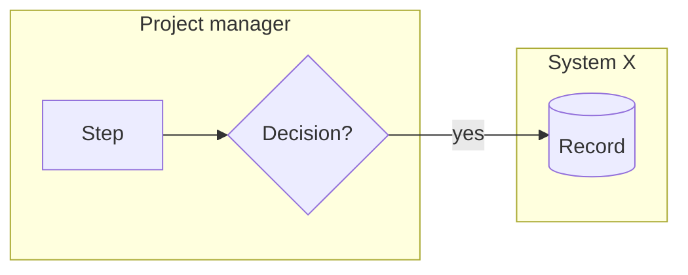

# 02 — Current-state pack: <product>

**Objective IDs:** CPMAI-1.1.1 · AB100-1.1.1 · AB410-1.1.1
**Author:** Warwick · **Date:** · **Status:** Draft | Reviewed

## Process map (as it really happens, including workarounds)

## Steps

| # | Step | Actor | System(s) | Input → output | Decision / judgement? | Control it serves | Pain / waste / risk |
|---|---|---|---|---|---|---|---|
| 1 | | | | | | | |

## Observations

- Handoffs and waiting:
- Duplication / re-keying:
- Where manual judgement genuinely occurs:
- Bottlenecks:
- Controls that must survive any change:

## Stakeholder and authority model

| Role / person | Requests | Performs | Decides | Approves | Owns process | Owns authoritative data | Operates / supports the solution | Bears the risk when it fails |
|---|---|---|---|---|---|---|---|---|
| | | | | | | | | |

This table later defines human-in-the-loop points and architecture authority boundaries — be precise about *approves* vs *is informed*.
