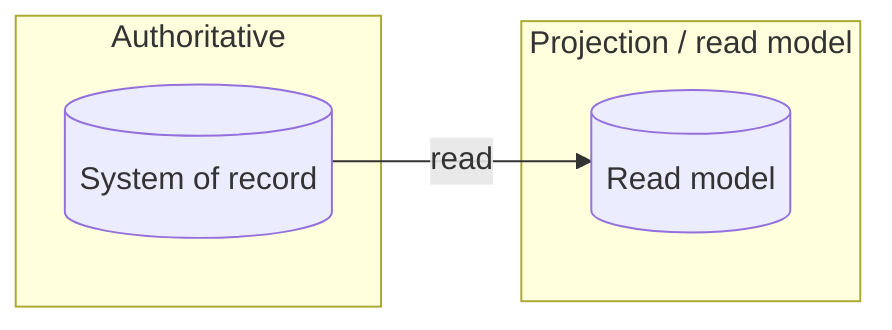

# 04 — Data, authority & constraints pack: <product>

**Objective IDs:** CPMAI-1.1 · CPMAI-2.3 · CPMAI-3.1 · CPMAI-3.3 · CPMAI-3.6 · CPMAI-3.7 · CPMAI-3.8 · AB100-1.1.2 · AB100-1.1.3 · AB100-3.4.6 · AB100-3.4.7 · AB620-1.1.1 · AB620-1.1.2 · AB620-1.1.5
**Author:** Warwick · **Date:** · **Status:** Draft | Reviewed

## Systems and data

| System | Entity / data | Authoritative? | Read path | Write path | Owner | Quality | Availability | Permissions / identity | Sensitivity | Retention / residency | Unknowns → ASSUMPTIONS ref |
|---|---|---|---|---|---|---|---|---|---|---|---|
| | | | | | | | | | | | |

## Source-of-truth map

## Authority boundaries

| Action | Who/what may perform it today | Proposed delegation | Threshold / condition | Approval route |
|---|---|---|---|---|
| e.g. create a record in X | | none / deterministic / agent within limits | | |

## Constraints

- Identity / access:
- Licences / environments:
- DLP / security / compliance:
- External or consequential actions:
- Operational / support:
- Adoption / change:

## Risks, assumptions, dependencies

Link, don't duplicate: each row references `ASSUMPTIONS.md` (A-ids) or is added there first.

| Ref | Type (risk / assumption / dependency) | Statement | Impact if wrong | Treatment | Owner |
|---|---|---|---|---|---|
| A?? | | | | | |
